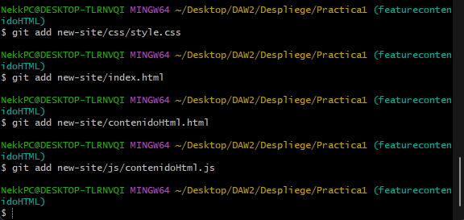

# Que es Git?

Git es el sistema de control de versiones mas usado actualmente, se caracteriza por su velocidad, su sencillez y su soporte para desarrollo no lineal.

# Que es la metodologia Git Flow?

La metodologia Git Flow consiste en el uso de dos tipos de ramas, ramas principales que tienen un tiempo de vida no definido y ramas de funcion que tienen un tiempo limitado.

Las ramas principales por lo general no sera necesario hacer commits sobre ellas, su evolucion se basara en merges de ramas de funcion.
Tendremos dos ramas principales, Master o Main y Development.

Las ramas de funcion son sobre las que realizaremos commits, hay tres tipos de ellas, feature, hotfix y release, cada una de ellas con funciones especificas.

# Porque hemos usado Git Flow?

Hemos usado Git Flow ya que es una buena metodologia para proyectos complejos y nos ayuda a distribuir la carga de trabajo, pudiendo separar el desarrollo de funciones en diferentes desarrolladores y asi disminuyendo posibles errores.

# Como ha sido el proceso?
Primero, el desarrollador jefe se ha encargado de crear el repositorio local:

Despues ha implementado el html boilerplate:

Ahora ha subido el repositorio local al repositorio remoto en GitHub:

Como podemos ver, en este punto las ramas ya se pueden ver en GitHub:

Ahora nuestro segundo desarrollador se va a encargar de crear e implementar sus dos features correspondientes:

Ahora sera el turno de nuestro tercer desarrollador, el se encargara de crear e implementar su feature y ademas de hacer la primera release de nuestro proyecto:

Una vez hecho el release, el desarrollador jefe penso que se podian hacer unas mejoras en algun apartado, por lo que se realizo un hotfix: 

Para terminar se realizo un push con todos los cambios al repositorio remoto:

